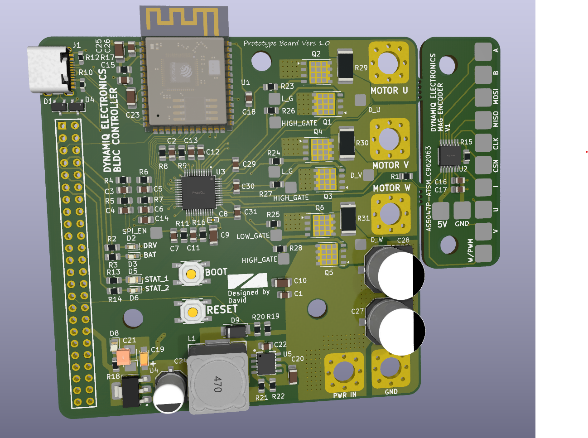

# A simple Brushless Motor Controller

I'm currently on the journey of creating a simple cost effective controller that
will eventually be sold to the masses to remove the high barrier to entry into using high performing brushless motor actuators.

FRC Falcon 500 Motors inspired this project, since there are no suitable motor options at a suitable price that enables hobbyists to utilise these amazing pieces of technology. (Odrive being 200USD+)

# This project is still in its very early stages...
(Do note this is actually my very second PCB designed, so I lack a lot of experience)

Version 1 of the PCB worked with the following code. However I ended up frying two of the boards during programming and tinkering with the board. I am currently working on a version 2 iteration of the PCB from the mistakes and lack of safety features in V1. 

(I actually got the motor to turn on the very first iteration of this board which is a massive win)

## Failures so far...
- Somehow killed the TMC6200 gate driver while I was tinkering with the code. it does not like being fed a PWM duty cycle of greater than 40%
- Magic smoke occured on my buck converter where 4s Lipo is converted to 5V. Still unsure what happened here, but I have a few hypothesis. Sketchy soldering on my ESP32 3.3v and ground pin causing a short. Or accidentally shorting the the SPI clock pin with ground while unplugging the jumpers.
- The board does heat up, perhaps 2oZ layers may be needed (opted out since it was expensive for iter1)
- Practically no protection circuitry at all, except for the built in ones in the gate driver

# Improvements Underway
The progress on the code is halted as I have no working boards anymore since I fried all 2 of them haha.
- Integrate reverse polarity protection with a MOSFET Diode*
- Remove the chunky header pin and replace it with smaller header pins that connect to encoders and etc
- Initial inrush current limit to stop the spark when I connect my lipo to the board
- Fuses... Fuses and more fuses
- Change my LDO to a newer IC for more efficiency
- Capacitors on the phase output?
- Current sensing was not tested before the boards fried themselves ( caps on current sens outputs for a better averages value?)

# Other Unstructured Yap
PCB was manufactured by JLPCB, assembly services was also opted, 5 boards were 10 bucks aud and assembly and parts for 2 board added $150 aud

Reddit also reviewd my board before I manufactured it heres the link to that discussion
https://www.reddit.com/r/PCB/comments/1lk1n3d/review_request_my_first_pcb_bldc_sinusoidal/

This man made coding this thing a lot easier. Just pass sine waves into the motor and itll turn. I reckon it was much more easier to implement than step control.
https://www.youtube.com/watch?v=zSdetJsSeNw&t

Cool channels
- https://www.youtube.com/watch?v=mbJOxqxLkLE
- https://www.youtube.com/watch?v=e0sQnVmE7DU

If you'd like to contact me for more information or collaboration on this project feel free to DM me on insta at DJAY10101, or if you prefer email its djay01602@gmail.com

